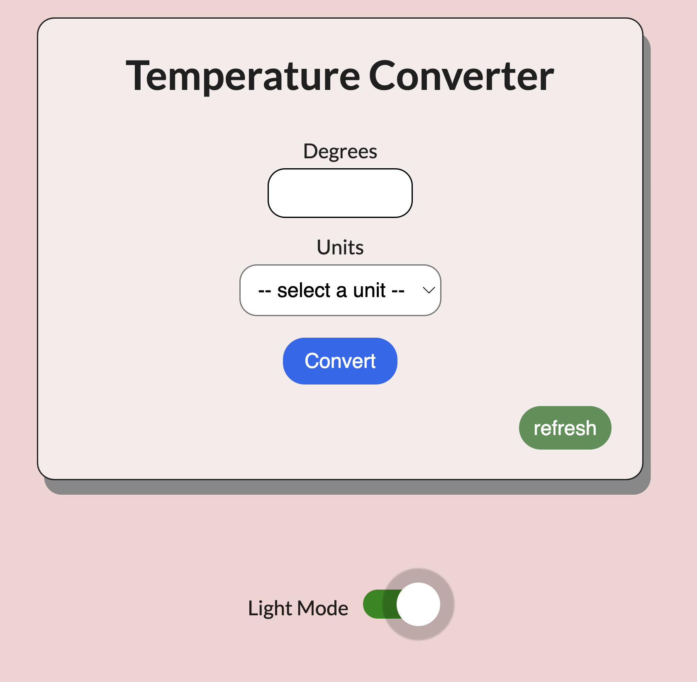

# <u align="center">Temperature Converter</u>

<p align="center"> 
<a href=""> </a>
</p>

## <u>About the Project</u>
 A simple, user-friendly, SPA temperature converter. Currently, users can convert between celsius and fahrenheit, and visa versa. Furthermore, users can refresh settings with ease by simply pressing the refresh button; they can also toggle between dark and light mode for a more pleasurable viewing experience.

### Tech Stack:

- React.js
- React Switch
- Node.js
- Material UI

    - Framework: React.js
        - First, the app requires various data from the user such as a numerical input and a unit of temperature.
        - Next, depending on what the user inputs, this data needs to be stored in a place where the entire app can access it, and update it accordingly, so it can be used by other parts of the code; e.g. converting a numerical unit from celsius to fahrenheit.  
        - Thus, due to the complexity of how data needs to be organzied and managed efficiently, I decided to use React.js because it is component based; components that manage their own state as well pass data throughout the app.

            * Component structure: 
                * The components have been appropriatedly separated based on their functionality: 
                    * App: The root/parent component. It handles the state values that need to be updated and accessed throughout the app. 
                        * TempInput: Child component of App. It handles the user input, specifically the numerical unit, and passes it to App.
                            * DropDown: Child component of TempInput. It handles the users selected unit(e.g. celsius or fahrenheit), and passes it to TempInput.
                        * ToggleSwitch: Child component of App. It handles the functionality of toggling between light and dark mode.  

    - UI Design: React-Switch & Material UI 
        - The simplicity of the app required a minimalistic UI, so I decided to incorporate libraries that would help me to achieve this. 
            * React-Switch: used to create the toggle button for toggling between light and dark mode.
            * Material UI: used to display clean, precise, user-friendly error messages.

## <u>Getting Started</u>

#### Pre-requisites:

 - NPM: 
```npm install npm@latest```

#### Installation:

- Clone the repository:
```git clone https://github.com/Roman4u/my-tempapp```

- Install NPM packages:
```npm install```

#### Build:

- Run the build command
```npm run build```

#### Deployment:

- Deploy to GitHub pages
```npm run deploy```

 ## <u>Usage</u>  

 - **First, begin with the degree and unit you wish to convert:** 

    1. In the top input field, enter a numerical value for the degree
    2. In the second, select the unit you wish to have converted
    3. Press the ```convert``` button
    4. Press the ```refresh``` button to make another conversion 

 - **Error Handling**
    - In the case that either a degree is not input or a unit is not selected, an error message will instruct you to follow those steps.

 - **Page Refresh**
    - To assist the user in having an easy experience, the refresh button clears the page and resets the values.

- **Toggle between light or dark mode**
    - Clicking this switch button will change the UI from dark to light mode, and visa versa

## <u>Future Features</u>
- Incorporate more units of measurement
- Create a logo and icon for the app

## <u>Contribute</u>

- Option 1. Fork the repo and create a pull request.
- Option 2. Open an issue with the tag enhancement
